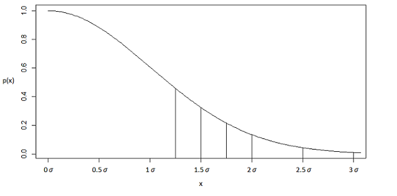

#Using DSsim to investigate Truncation Distances

##1. Introduction

DSsim is a tool which simulates the distance sampling process.  This process has three main stages: firstly the simulation has to generate a population from the description that it is given; then the observation process has to be simulated based on a known detectability function and the survey design and finally the observations need to be analysed.  Simulations therefore need to be built from several components, each of which must be built by the user.  


When fitting a detection function the data is often truncated at some distance from the transect.  The number of detections will decrease at larger distances from the transect and leaving in widely dispersed observations can lead to bias in the estimate of abundance by distorting the shape of the detection function.  It has been suggested that a good rule of thumb is to truncate the data where the estimated probability of detection is 0.15 [@Buckland:2001vm] however this has been a topic of much discussion.

This vignette gives an investigation into how truncation distances affect the accuracy and precision of the estimates of a population size as an example of using DSsim to solve a distance sampling problem. Simulations will be run with truncation distances at different multiples of $\sigma$.  For a half normal detection function the suggested truncation distance is approximately 2$\sigma$.



In the first section each of the components of a simulation is built and then they are all fit together as a simulation.  The second section will explore the results of these simulations and how they are structured before the final section will briefly summarise the results of the investigation. 

##2. Setup

Firstly the package needs to be loaded and also the seed has been set so that the results in this vignette can be easily reproduced.  The package _shapefiles_ will also be required. 
```{r warning=FALSE, message=FALSE}
library(DSsim)
library(shapefiles)
set.seed(321)
```

##3. Making the Simulation Components

###3.1 The Region
The first part of the simulation which must be created is the region.  For the investigation into the effects of truncation distances on the estimates of population abundance a simple 20km by 5km rectangular region will be used.  This will require a shapefile which describes the region.  In order to estimate the abundance in the region DSsim needs the area of the region.  This will be calculated using _areapl_ from the _splancs_ package [@splancs-pkg].  If this is not suitable then DSsim can be provided with an area that has been calculated elsewhere using the area argument of _make.region_.  The following code creates the region and plots it in Figure 2:
```{r fig.cap="Figure 3", fig.align="center", fig.width = 7, fig.height = 5}
region.shapefile <- read.shapefile("Study_ar")
region <- make.region(region.name = "Survey Region", units = "m", shapefile = region.shapefile)
plot(region)
```

###3.2 The Population
The next part of the simulation that is needed is the population description.  However in order to make the population description DSsim first needs a description of the population density.  For the investigation into truncation distances it is sufficient to have a constant density over the whole surface.  Furthermore when the simulation later generates a population during the simulation it will do so using a known population size so the value of this constant isn't important, so a value of 1 is used here.  The _x.space_ and _y.space_ arguments describe how spaced out the grid points on the density surface are.  As the density surface will be the same everywhere this doesn't matter too much, however if the density surface varies a lot then it may be wise to decrease the spacing between grid points in order to allow finer detail on the surface.  This code produces the density object and plots it over the region in figure 3:
```{r fig.cap="Figure 4", fig.align="center", fig.width = 7, fig.height = 5}
pop.density <- make.density(region = region, x.space = 1000, y.space = 1000, constant = 1) 
plot(pop.density, plot.units = "km", style = "blocks")
plot(region, add = TRUE)
```

Now that a description of the density across the region is available the population description can be put together from which the simulation will generate a population.  A fixed value for the population size, N=250, is given. If this is not given then DSsim will generate the population using the average density across the region.   
```{r}
pop.description <- make.population.description(region.obj = region, density.obj = pop.density, N = 250, fixed.N = TRUE)
```

###3.3 The Detection Function
Now all of the parts of the simulation that will be needed to generate a population for the survey region have been created.  Next the components that will be used to simulate the observation process need to be made.  The first of these is the known detection function.  The key function can be one of _hn_(half normal), _hr_(hazard rate) or _uf_(uniform).  Here a half normal with scale parameter _100_ and a observation truncation distance of 500 is used:
```{r}
detect <- make.detectability(key.function = "hn", scale.param = 100, truncation = 500)
```

###3.4 The Survey Design
Simulating the observation process also requires a survey  design.  Currently creating survey designs from scratch has not been implemented in DSsim and the surveys must be created in advance and saved as shapefiles using the Distance for Windows software [@Thomas:2010cf]. For the investigation a systematic parallel line transect design with a spacing of 1km between transects was used.  The transects were orientated so that they were running across the narrower dimension of the study region, this resulted in 20 transects per survey. The recommended minimum number of transects for line transect studies is from 10-20 [@Buckland:2001vm].
```{r}
parallel.design <- make.design(transect.type = "Line",design.details = c("Parallel","Systematic"),region.obj = region, path = "shapefiles")
```

###3.5 The Analysis
Finally the simulation needs to know how to analyse the results of the observation process.  A list of models which can be fitted to the distance data will be made and the simulation will select the one with the minimum criteria value.  In the truncation distances investigationw the simulation was allowed to decide between a hazard rate model and a half normal model.  AIC was used to select the model and the first truncation distance that was used was 1.25$\sigma$:
```{r}
sigma = 100
ddf.analyses <- make.ddf.analysis.list(dsmodel = list(~cds(key = "hn", formula = ~1), ~cds(key = "hr", formula = ~1)), method = "ds", criteria = "AIC", truncation = 1.25*sigma)
```

###3.6 The Simulations
Now that all of the components of the simulation have been made the simulation is made by putting them all together:
```{r}
simtrunc125aichnhr <- make.simulation(reps = 999, single.transect.set = FALSE, region.obj = region, design.obj = parallel.design, population.description.obj = pop.description, detectability.obj = detect, ddf.analyses.list = ddf.analyses)
```

As simulations can take a long time to run it is often worth checking that the setup is right first.
The first thing that should be checked is that a population is being correctly generated within the region:
```{r fig.cap="Figure 5", fig.align="center", fig.width = 7, fig.height = 5}
pop <- generate.population(simtrunc125aichnhr)
plot(region)
plot(pop)
```

Next it should be checked that the transects have been placed correctly:
```{r fig.cap="Figure 6", fig.align="center", fig.width = 7, fig.height = 5}
transects <- generate.transects(simtrunc125aichnhr)
plot(region)
plot(transects, col = 4, lwd = 2)
```

The observation process can be quickly simulated once to ensure that it is working correctly.  The distance from each animal to the transects will be used to calculate the probability of the animal being detected.  Then Bernoulli trials with these probabilities of success are carried  out for each of the animals.  The observed animals are marked as blue points, the unobserved animals are the red points:
```{r fig.cap="Figure 7", fig.align="center", fig.width = 7, fig.height = 5}
eg.survey <- create.survey.results(simtrunc125aichnhr)
plot(eg.survey)
```

This distance data can also be viewed in a histogram to get an idea of what the fitted detection function will look like:
```{r fig.cap="Figure 8", fig.align="center", fig.width = 5, fig.height = 5}
dist.data <- get.distance.data(eg.survey)
hist(dist.data$distance, xlab = "Distance (m)", main = "Distance Data")
```

If the setup has been done right the simulation can now be run.  For the investigation multiple simulations over the same region will be run so to improve efficiency the population data was saved using the _save.data_ and _data.path_ arguments:
```{r cache=TRUE, warning=FALSE, message=FALSE}
simtrunc125 <- run(simtrunc125aichnhr, save.data = TRUE, data.path = "Data")
```

More simulations are then needed for the investigation; each using different truncation distances for the analysis.  After changing a part of the simulation it is necessary to make the simulation again to update it.  The _load.data_ and _data.path_ arguments are used to load the data from the first simulation that was run to improve efficiency:
```{r cache=TRUE, warning=FALSE, results='hide'}
Trun.dists <- c(1.5*sigma, 1.75*sigma, 2*sigma, 2.5*sigma, 3*sigma)
sims <- vector("list", length(Trun.dists+1))
sims[[1]]<-simtrunc125
for(i in 2:6){
  ddf.analyses <- make.ddf.analysis.list(dsmodel = list(~cds(key = "hn", formula = ~1), ~cds(key = "hr", formula = ~1)), method = "ds", criteria = "AIC", truncation = Trun.dists[[i-1]])
  sim <- make.simulation(reps = 999, single.transect.set = FALSE, region.obj = region, design.obj = parallel.design, population.description.obj = pop.description, detectability.obj = detect, ddf.analyses.list = ddf.analyses)
  sim  <- run(sim, load.data = TRUE, data.path = "Data")
  sims[[i]]<-sim
}
```

##4. The Results

The results of a simulation can be viewed by calling *summary* on the simulation object:
```{r eval=FALSE}
#Not run
summary(sims[[1]])
```

However this investigation involves running multiple simulations and spotting patterns from the summaries can be quite difficult.  Instead we will extract the required information from the simulation objects and table it using the package *xtable*:
```{r message=FALSE}
library(xtable)
```

***

**Need to table CI coverage**
  
**Not sure how to explain where to extract data from without getting too technical, would be good to have get methods to save hassle**

***
```{r results="asis", message=FALSE, fig.cap = "Table 1"}
Trunc.Dist = rep(NA, 6)
for(i in 1:length(sims)){ Trunc.Dist[i] = sims[[i]]@ddf.analyses[[1]]@truncation}

n = rep(NA, 6)
for(i in 1:length(sims)){ n[i] = sims[[i]]@results$individuals$summary[1,4,1000]}

Est.Abund = rep(NA, 6)
for(i in 1:length(sims)){ Est.Abund[i] = sims[[i]]@results$individuals$N[1,1,1000] }

mean.se = rep(NA, 6)
for(i in 1:length(sims)){ mean.se[i] = sims[[i]]@results$individuals$N[1,2,1000] }

Perc.Bias = 100*(Est.Abund - 250)/250

RMSE = rep(NA, 6)
for(i in 1:length(sims)){ RMSE[i] = sqrt(sum((sims[[i]]@results$individuals$N[1,1,1:999]-250)**2)/999) 
}

Model.selection <- function(simulation){
  sum = 0
  for(x in simulation@results$Detection[1,5,1:999]){
    if(!is.na(x) && x=="2"){
      sum=sum+1
    }
  }
  return(c(999-sum, sum))
}

model.selection.numbers = rep(NA, 6)
for(i in 1:length(sims)){
  model.selection.numbers[i] = Model.selection(sims[[i]])[1]
}

perc.correct.selection = rep(NA, 6)
for(i in 1:length(sims)){
  perc.correct.selection[i]=100*model.selection.numbers[i]/999
}

simulation.data = data.frame( Trunc.Dist = Trunc.Dist, n=n, Est.Abund = Est.Abund, mean.se = mean.se, Perc.Bias = Perc.Bias, RMSE=RMSE, Correct.Select = perc.correct.selection)
table<-xtable(simulation.data, label = "Table", align = c('c', 'c', 'c', 'c', 'c', 'c', 'c', 'c'), digits = c(0, 0, 0, 2, 2, 2, 2, 2))
colnames(table) <- c("$Trunc Dist$", "$n$", "$Mean \\hat{N}$", "$SE$", "$\\% Bias$", "$RMSE$", "$\\% Correct Select$")
print(table, floating=TRUE, include.rownames = FALSE, NA.string="NA", caption = "Simulation Results", caption.placement="top", table.placement="!h", sanitize.colnames.function = identity, latex.environments="center", type = "html")
```

```{r fig.cap = "Figure 9", fig.align="center", fig.width = 5, fig.height = 5}
library(ggplot2)
data = data.frame(truncation = factor(rep(c(125, 150, 175, 200, 250, 300), each=999)), estimates = c(sims[[1]]@results$individuals$N[1,1,1:999], sims[[2]]@results$individuals$N[1,1,1:999], sims[[3]]@results$individuals$N[1,1,1:999], sims[[4]]@results$individuals$N[1,1,1:999], sims[[5]]@results$individuals$N[1,1,1:999], sims[[6]]@results$individuals$N[1,1,1:999]))

ggplot(data, aes(x = truncation, y = estimates)) + geom_boxplot() + geom_hline(yintercept = 250, linetype="dashed", color = "red", size = 1.2) + stat_summary(fun.y = mean, geom="point", size = 2, color = "blue")
```


##5. The Conclusions

##6. References