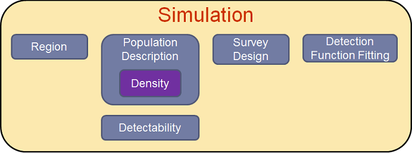

#Using DSsim to investigate Truncation Distances

##1. Introduction
Distance Sampling is a process in which an area is surveyed so that the size of a population within the area can be estimated.  Distances from a set of transects to observed objects are recorded and this data is used to model a detectability function.  From this the population in the whole area can be estimated.  

###1.1 Introduction to DSsim

DSsim is a tool which simulates this process.  DSsim splits the process into three stages.  First it generates a population across the region.  This is the population that we are trying to measure the size of.  After that DSsim simulates the distance sampling survey.  This is done using a detectability function and a survey design.  For the final stage DSsim analyses the data which is output from the survey.



When fitting a detection function the data is often truncated at some distance from the transect.  The number of detections will decrease at larger distances from the transect and leaving in widely dispersed observations can lead to bias in the estimate of abundance by distorting the shape of the detection function.  It has been suggested that a good rule of thumb is to truncate the data where the estimated probability of detection is 0.15 [@Buckland:2001vm] however this has been a topic of much discussion.

This vignette explores how truncation distances affect the accuracy and precision of the estimates of a population size.  This will be used to provide examples of how to use DSsim to make and run simulations as well as how to analyse the results.  Simulations will be run with truncation distances at different multiples of $\sigma$.  For a half normal detection function the suggested truncation distance is approximately 2$\sigma$ and for a hazard rate detection function with shape parameter 4 this is approximately 1.5$\sigma$. 


The rest of this vignette will guide you through the steps to create and run a series of simulations to investigate the effects of varying truncation distance.  For the advanced reader we also inlude sections describing how to save the data from a simulation in order to speed up subsequent simulations using the same population and on how to include model selection in the investigation.  In the results section w describe how truncation distance affects the accuracy and precision of the distance sampling abundance estimates.  Finally we conclude by discussing the implications of our findings for carrying out distance sampling surveys in practice.


##2. Methods

###2.1 Setup

Firstly the package needs to be loaded and also the seed has been set so that the results in this vignette can be easily reproduced.  The package _shapefiles_ will also be required. 
```{r setup, warning=FALSE, message=FALSE}
library(DSsim)
library(shapefiles)
set.seed(4321)
```

##2.2 Making the Simulation Components

###2.2.1 Region
The first part of the simulation is the region.  For the investigation a simple 20km by 5km rectangular region will be used.  This requires a shapefile which describes the region.  In order to estimate the abundance in the region DSsim needs the area of the region.  DSsim calculates this automatically using _areapl_ from the _splancs_ package [@splancs-pkg].  If this is not suitable then DSsim can be provided with an area that has been calculated elsewhere using the area argument of _make.region_.  The following code creates the region and plots it in Figure 3:
```{r region, fig.cap="Figure 3 - Region", fig.align="center", fig.width = 7, fig.height = 5}
region.shapefile <- read.shapefile("Study_ar")
region <- make.region(region.name = "Survey Region", units = "m", shapefile = region.shapefile)
plot(region)
```

###2.2.2 Population
The population description first needs a description of the population density.  For the investigation we will use a constant density over the whole surface.  Furthermore when the simulation later generates a population during the simulation it will do so using a known population size so the value of this constant isn't important.  The _x.space_ and _y.space_ arguments describe the grid points on the density surface.  As the density surface will be the same everywhere this doesn't matter too much, however if the density surface varies a lot then it may be wise to decrease the spacing between grid points in order to allow finer detail on the surface.  This code produces the density object and plots it over the region in figure 4:
```{r density, fig.cap="Figure 4", fig.align="center", fig.width = 7, fig.height = 5}
pop.density <- make.density(region = region, x.space = 1000, y.space = 1000, constant = 1) 
plot(pop.density, plot.units = "km", style = "blocks")
plot(region, add = TRUE)
```

Now that a description of the density across the region is available the population description can be put together from which the simulation will generate a population.  A fixed value for the population size, N=250, is given. We have chosen 250 because this results in around 60 observations, the minimum number of recomendations usually recommended for distance sampling surveys.  This will ensure that any effects of truncation distance are not obscured by using a large population size. If this is not given then DSsim will generate the population using the average density across the region.   
```{r population}
pop.description <- make.population.description(region.obj = region, density.obj = pop.density, N = 250, fixed.N = TRUE)
```

###2.2.3 Defining Detectability
Next the components that will be used to simulate the observation process need to be made.  The first of these is the known detection function.  The key function can be one of _hn_(half normal) or _hr_(hazard rate).  Here a half normal with scale parameter _100_ and a observation truncation distance of 500 is used:
```{r detection}
detect <- make.detectability(key.function = "hn", scale.param = 100, truncation = 500)
```

###2.2.4 Design
When carrying out a distance sampling survey it is important to create a survey based on a design. Currently this cannot be done using DSsim and must be done using other software.  Here we have done this using the Distance for Windows software [@Thomas:2010cf].  A systematic parallel line transect design with a spacing of 1km between transects was used.  The transects were orientated so that they were running across the narrower dimension of the study region, this resulted in 20 transects per survey. The recommended minimum number of transects for line transect studies is from 10-20 [@Buckland:2001vm].
```{r design}
parallel.design <- make.design(transect.type = "Line",design.details = c("Parallel","Systematic"),region.obj = region, path = "shapefiles")
```

###2.2.5 Analysis
Finally the simulation needs to know how to analyse the results of the observation process.  A list of models which can be fitted to the distance data will be made and the simulation will select the one with the minimum criteria value.  In the truncation distances investigationw the simulation was allowed to decide between a hazard rate model and a half normal model.  AIC was used to select the model and the first truncation distance that was used was 1.25$\sigma$:
```{r analyses}
sigma = 100
ddf.analyses <- make.ddf.analysis.list(dsmodel = list(~cds(key = "hn", formula = ~1)), method = "ds", criteria = "AIC", truncation = 125)
```

###2.2.5.1 Model Selection
To be added

###2.2.6 Simulations
Now that all of the components of the simulation have been made the simulation is made by putting them all together:
```{r make.sim}
simtrunc125 <- make.simulation(reps = 999, single.transect.set = FALSE, region.obj = region, design.obj = parallel.design, population.description.obj = pop.description, detectability.obj = detect, ddf.analyses.list = ddf.analyses)
```

As simulations can take a long time to run it is often worth checking that the setup is right first.
The first thing that should be checked is that a population is being correctly generated within the region:
```{r gen.pop, fig.cap="Figure 5", fig.align="center", fig.width = 7, fig.height = 5}
pop <- generate.population(simtrunc125)
plot(region)
plot(pop)
```

Next it should be checked that the transects have been placed correctly:
```{r gen.transects, fig.cap="Figure 6", fig.align="center", fig.width = 7, fig.height = 5}
transects <- generate.transects(simtrunc125)
plot(region)
plot(transects, col = 4, lwd = 2)
```

The observation process can be quickly simulated once to ensure that it is working correctly.  The distance from each animal to the transects will be used to calculate the probability of the animal being detected.  Then Bernoulli trials with these probabilities of success are carried  out for each of the animals.  The observed animals are marked as blue points, the unobserved animals are the red points:
```{r survey, fig.cap="Figure 7", fig.align="center", fig.width = 7, fig.height = 5}
eg.survey <- create.survey.results(simtrunc125)
plot(eg.survey)
```

This distance data can also be viewed in a histogram to get an idea of what the fitted detection function will look like:
```{r dist.data, fig.cap="Figure 8", fig.align="center", fig.width = 5, fig.height = 5}
dist.data <- get.distance.data(eg.survey)
hist(dist.data$distance, xlab = "Distance (m)", main = "Distance Data")
```

If the setup has been done right the simulation can now be run but first we will reset the seed so that subsequent simulations use the same population:
```{r first.sim, cache = TRUE, warning=FALSE, message=FALSE}
set.seed(4321)
simtrunc125 <- run(simtrunc125)
```

More simulations are then needed for the investigation; each using different truncation distances for the analysis.  After changing a part of the simulation it is necessary to make the simulation again to update it:
```{r sims, cache=TRUE, warning=FALSE, results='hide'}
Trun.dists <- c(1.25*sigma, 1.5*sigma, 1.75*sigma, 2*sigma, 2.5*sigma, 3*sigma)
sims <- vector("list", length(Trun.dists))
sims[[1]]<-simtrunc125
for(i in 2:6){
  set.seed(4321)
  ddf.analyses <- make.ddf.analysis.list(dsmodel = list(~cds(key = "hn", formula = ~1)), method = "ds", criteria = "AIC", truncation = Trun.dists[[i]])
  sim <- make.simulation(reps = 999, single.transect.set = FALSE, region.obj = region, design.obj = parallel.design, population.description.obj = pop.description, detectability.obj = detect, ddf.analyses.list = ddf.analyses)
  sim  <- run(sim, save.data=TRUE, data.path = eval(paste("Results/trunc",Trun.dists[i], sep = "")))
  sims[[i]]<-sim
}
```

##3. Extracting the Results

The results of simulations can be viewed by calling *summary* on the simulation object:
```{r summary, eval=FALSE}
#Not run
summary(sims[[1]])
```

This investigation involves running multiple simulations so instead we will write some functions to extract information from the simulation objects.  It is not necessary to understand how these functions work, details are provided here for interested readers however the reader could just run the code and skip to the next section if they prefer.

***
  
**SECTION NEEDS REWORKED FOR NEW GET FUNCTION**

***
  
The first pieces of information that we can extract from the simulation is the known size of the population and the number of times the simulation was repeated.  These will be useful for extracting other information later.
  
```{r}
extract.info <- function(simulation, info.name){
  switch(info.name,
         N = simulation@population.description@N,
         reps = simulation@reps,
         truncation.distance = simulation@ddf.analyses[[1]]@truncation,
         n = simulation@results$individuals$summary[1,4,1000],
         estimated.abundance = simulation@results$individuals$N[1,1,1000],
         mean.se = simulation@results$individuals$N[1,2,1000],
         percentage.bias = 100*((simulation@results$individuals$N[1,1,1000] - simulation@population.description@N)/simulation@population.description@N),
         RMSE = sqrt(sum((simulation@results$individuals$N[1,1,1:simulation@reps]-simulation@population.description@N)**2)/simulation@reps))
}

extract.N <- function(simulation){
  return(simulation@population.description@N)
}

extract.reps <- function(simulation){
  return(simulation@reps)
}
```


This investigation focuses on the effects of truncation distance so the truncation distances will be extracted first:
```{r}
extract.trun.dist <- function(simulation){
  return(simulation@ddf.analyses[[1]]@truncation)
}
```

Next it will be useful to know how the truncation distances has affected the number of observations:

```{r}
extract.n <- function(simulation){
  return(simulation@results$individuals$summary[1,4,1000])
}
```

The estimated population size and mean squared error will also be important:
```{r}
extract.est.abund <- function(simulation){
  return(simulation@results$individuals$N[1,1,1000])
}

extract.mean.se <- function(simulation){
  return(simulation@results$individuals$N[1,2,1000])
}
```


Using the known popultion size and the estimated population size the percentage bias can be calculated:
```{r}
extract.perc.bias <- function(simulation){
  N <- extract.N(simulation)
  Est.Abund <- extract.est.abund(simulation)
  return(100*(Est.Abund-N)/N)
}
```

Using the known population size and the values of the estimated population size from each of the repetitions of the simulation the root mean squared error(RMSE) can be calculated:
```{r}
extract.RMSE <- function(simulation){
  N <- extract.N(simulation)
  reps <- extract.reps(simulation)
  results <- simulation@results$individuals$N[1,1,1:reps]
  return(sqrt(sum((results-N)**2)/reps))
}
```

##4. The Results

Once the results have been extracted the function _kable_ from the package _knitr_ will be used to table the results:
```{r message=FALSE}
library(knitr)
```

Using the function _lapply_ the results from all of the simulations in  the list can be quickly extracted using the functions defined in Section 4:
```{r}
Trunc.Dist <- lapply(sims, extract.info, info.name = "truncation.distance")

n <- lapply(sims, extract.info, info.name = "n")

Est.Abund <- lapply(sims, extract.info, info.name = "estimated.abundance")

mean.se <- lapply(sims, extract.info, info.name = "mean.se")

Perc.Bias <- lapply(sims, extract.info, info.name = "percentage.bias")

RMSE = lapply(sims, extract.info, info.name = "RMSE")
```

Then the results must be combined into a data frame to be tabled:
```{r}
simulation.data = cbind(Trunc.Dist = Trunc.Dist, n=n, Est.Abund = Est.Abund, mean.se = mean.se, Perc.Bias = Perc.Bias, RMSE=RMSE)
```


Finally the results can be tabled.  The align argument has been used  to centre the results in each column and the digits argument has been used to specify the number of decimal places in each column. Both of these arguments should be lists that are one longer than the number of columns in the data frame as the first entry describes the row names column.  The column names have then been set as Latex labels before the table was printed, then when the table was printed the _sanitize.colnames.function_ was set to identity to ensure that the latex labels were output correctly.  When printing the table the _include.rownames_ argment has been set as FALSE so that we only print the data from the data frame.
```{r results="asis", message=FALSE, fig.cap = "Table 1"}
table<-kable(simulation.data, digits = c(0, 0, 2, 2, 2, 2), col.names = c("$Trunc Dist$", "$n$", "$Mean \\hat{N}$", "$SE$", "$\\% Bias$", "$RMSE$"), align = c('c', 'c', 'c', 'c', 'c', 'c', 'c') )
print(table, floating=TRUE, include.rownames = FALSE, NA.string="NA", caption = "Simulation Results", caption.placement="top", table.placement="!h", latex.environments="center", type = "html")
```

For distance sampling surveys it is usually recommended to have a minimum of 60-80 detections[@Buckland:2001vm] however even at this small number of observations $\% Bias$ is small.  Increasing the truncation distance does seem to have increased this bias slightly however there is clearly a trend in RMSE which shows that the increase in precision, which can be seen in the standard error, greatly outweighs this effect:
```{r fig.cap = "Figure 9", fig.align="center", fig.width = 5, fig.height = 5}
plot(Trunc.Dist, RMSE)
```

```{r fig.cap = "Figure 10", fig.align="center", fig.width = 5, fig.height = 5}
library(ggplot2)
data = data.frame(Truncation = factor(rep(c(125, 150, 175, 200, 250, 300), each=999)), Estimates = c(sims[[1]]@results$individuals$N[1,1,1:999], sims[[2]]@results$individuals$N[1,1,1:999], sims[[3]]@results$individuals$N[1,1,1:999], sims[[4]]@results$individuals$N[1,1,1:999], sims[[5]]@results$individuals$N[1,1,1:999], sims[[6]]@results$individuals$N[1,1,1:999]))

ggplot(data, aes(x = Truncation, y = Estimates)) + geom_boxplot() + geom_hline(yintercept = 250, linetype="dashed", color = "red", size = 1.2) + stat_summary(fun.y = mean, geom="point", size = 2, color = "blue")
```


##5. The Conclusions

##6. References