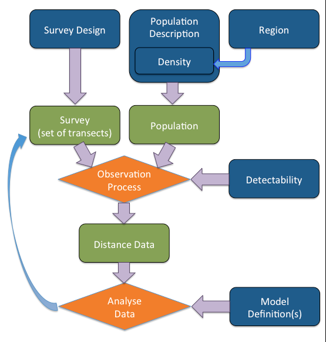

## 1. Introduction

Distance Sampling is a process in which a study area is surveyed in order to estimate the size of the population within it. It can be thought of as an extension to plot sampling. However, while plot sampling assumes that all objects within the plots are detected, distance sampling relaxes this assumption. To do this Distance sampling makes an assumptions about the distribution of objects with respect to the transects and to satisfy these assumptions the transects (the points or lines) must be randomly located with respect to the objects in the study region. Note that for the purposes of distance sampling an object can either be an individual or a cluster or individuals. 

The next step in distance sampling is then to record the distances from each detected object to the transect it was detected from and fit a detection function. From this function we can estimate how many objects were missed and hence the total number in the covered area. An example of a detection function is given in Figure 1. If our line transects have been placed at random within the study region then we would expect on average the same number of object to occur at any given distance from the transect. Therefore the drop in number of detection with increasing distance from the line can be attributed to a failure to detect all objects. We can therefore estimate from this detetection function that the probability of seeing an object within the covered region out to the truncation distance is the area under the curve (shaded grey) divided by the area of the rectangle.   

```{r detection function, warning=FALSE, message=FALSE, echo=FALSE, fig.width = 6, fig.cap="Figure 1: An Example detection function. The histogram shows example distances recorded from a line transect. The smooth curve is the detection function. The grey shaded area represents the number of detected objects and the diagonal hash region represents the number of objects in the covered region that were not detected."}
x <- seq(0, 70, length = 200)
scale <- 25
y <- exp(-x^2/(2*scale^2))

plot(x,y, type = "l", xlab = "Distance", ylab = "Probability of Detection", main = "Example Detection Function")

coords.x <- c(0,x,70,0)
coords.y <- c(0,y,0,0)
polygon(coords.x, coords.y, col = "grey")

coords.x <- c(0,70,x[200:1])
coords.y <- c(1,1,y[200:1])
polygon(coords.x, coords.y, density = 10, angle = 45)

norm.vals <- abs(rnorm(1000,0,25))
temp <- hist(norm.vals, plot = FALSE)
temp$density <- temp$density/temp$density[1]
plot(temp, freq = FALSE, add = TRUE)
```


The R package DSsim [@dssim-pkg] allows users to simulate distance sampling surveys and test out a range of design and analysis decisions specific to their population of interest. In order to simulate distance surveys the user must make some assuptions about the population of interest and the detection process giving rise to the observed distances. Simulations can be repeated over a range of assumptions so that the user can be confident that their chosen design will perform well despite any uncertainty.

While these simulations focus on the the issue of data truncation at the analysis stage, an example of using DSsim to compare survey designs can be found at <http://www.creem.st-and.ac.uk/DS.M&A/#survey-design-simulation-case-study>.

### 1.1 Introduction to DSsim

DSsim takes information from the user on the study region, population and detection process and uses it to generate distance sampling data. DSsim can then be asked to fit detection functions to this data and produce estimates of denisty, abundance and the associated uncertainty. DSsim splits this process into three stages. Firstly, it generates an instance of a population and a set of survey transects. Secondly, it simulates the distance sampling survey using the assumed detection function(s) provided by the user. Lastly, DSsim analyses the data from the survey. Figure 2 illustrates the simulation process and highlights the information which must be provided by the user.



### 1.2 Which Truncation Distance?

It is usual in distance sampling studies to truncate the data at some distance from the transect. This is because the observations far away from the transect are of lesser importance when fitting the detection function and these sparse observations at large distances could have high influence on model selection and possibly increase variability in estimated abundance / density.

[@Buckland:2001vm] suggests truncating the data where the probability of detection is around 0.15 as a general rule of thumb. However, where to truncate data often comes up as a discussion of concern for our workshop attendants. For a start distance sampling data is often very costly to obtain and discarding some of the data points can feel counter intuitive. In this vignette we therefore investigate truncation distance in distance sampling analyses. 

This vignette will firstly investigate data generated assuming a simple half normal detection function where every object has the same probability of detection at a specific distance from the transect. Figure 3 shows a simple half normal detection function with three possible truncation distances at $1*\sigma$, $2*\sigma$ and $3*\sigma$. The truncation distance at $2*\sigma$ gives a probability of detection of 0.135 so close to the 0.15 rule of thumb

```{r trunc dists1, warning=FALSE, message=FALSE, echo=FALSE, fig.width = 6, fig.cap="Figure 3: Half-normal detection function showing 3 proposed truncation distances at 1* $sigma$, 2* $sigma$ and 3* $sigma$. The truncation distance at twice sigma gives a probability of detection of 0.135 so close to the 0.15 rule of thumb."}

x <- seq(0, 80, length = 200)
scale <- 25
y <- exp(-x^2/(2*scale^2))

plot(x,y, type = "l", xlab = "Distance", ylab = "Probability of Detection", main = "Half-Normal Detection Function (sigma = 25)", lwd = 3)

# Add lines for truncation distances
x.lines <- c(25,50,75)
y.lines <- exp(-x.lines^2/(2*scale^2))

for(i in seq(along = x.lines)){
  lines(c(x.lines[i],x.lines[i]), c(0,y.lines[i]), col = 2, lwd = 3)
}

```

While these first simulations assume a simple half normal detection function, in reality individual objects or clusters of objects will likley have varying probability of being detected based on certain characteristics. Perhaps the behaviour of males will make them easier to detect. It is also easy to see that larger clusters of individuls will be easier to spot at large distances than small clusters. Therefore we will also investigate the effects of truncation distance when individual level covariates affect the probability of detection. Figure 4 shows how covariates may affect detectability. The most reliable way to estimate covariate effect is based on previous surveys. 

_(Perhaps also run simulations showing not to truncate to retrieve covariate parameter estimates?)_

```{r trunc dists2, warning=FALSE, message=FALSE, echo=FALSE, fig.width = 7.2, fig.cap="Figure 4: Half-normal detection function which varies based on cluster size and animal sex."}

library(DSsim)

covariate.list <- list()
covariate.list$size <- list(list("poisson", list(lambda = 35)))
covariate.list$sex <- list(data.frame(level = c("male", "female"), 
                                      prob = c(0.5,0.5)))
# Create covariate description
pop.desc <- make.population.description(covariates = covariate.list)

# define covariate parameters
cov.params <- list(size = c(0.015), 
                   sex = data.frame(level = c("male", "female"),
                                    param = c(0.9, -0.1)))

detect <- make.detectability(scale.param = 10, 
                             cov.param = cov.params, 
                             truncation = 60)

plot(detect, pop.desc)

```

### 1.3 Model Uncertainty and Pooling Robustness

When we simulate data we have to provide the detection function in order to generate detections and we therefore know the underlying true detection function. When collecting data in the field we will not have this information and so we will have to rely on some form of model selection. One method of model selection is to compare information criterion, DSsim allows the user to select either AIC, AICc or BIC as the model selection criteria. For these simulations we will use AIC and allow DSsim to select between a half-normal and a hazard rate model. 

In addition, if the probability of detection is affected by covariates then we may not only have a single underlying detection function but a combination of detction functions giving rise to our observed data. In this situation we can either model detectability as a function of these covariates or rely on a concept called pooling robustness. Pooling robustness refers to the fact that distance sampling techniques are robust to the pooling of multiple detection functions into one. This means that we do not necessarily need to include all the covariates which affect detectability in the detection function in order to estimate density / abundance. This vignette will test the concept of pooling robustness and check to see if it is affected by truncation distance. 

## 2. Methods

This vignette will guide you through the steps to create and run a series of simulations to investigate the effects of varying truncation distance on both data generated from a simple half-normal model and from a model where detectability is affected by a covariate.

## 2.1 Setup

First we load the DSsim library.

```{r setup, warning=FALSE, message=FALSE}
library(DSsim)
```

## 2.2 Simulation Components

As detailed in section 1.1 a simulation comprises of a number of components. DSsim is designed so that each of these components is defined individually before they are grouped together into a simulation. This helps keep the process clear and also allows reuse of simulation components between different simulations. Each of the functions to create a simulation component or simulation takes the form \code{make.<component>}.

### 2.2.1 Region

These simulations will use a rectangular study region of 5 km by 20 km. Survey regions can either be defined in km or m but all units must be the same throughout the different components of the simulation. Here we will define the coordinates in m. As this is a simple study region with few vertices we can simply imput the coordinates. The structure of the coordinates is a list of data.frames for each strata, themselves grouped together in a list. In this example we only have one polygon (so one data.frame) and one strata (one element in the main list). 

```{r region, warning=FALSE, message=FALSE, fig.width=4, fig.cap="Figure 5: The study region."}
# Create a polgon
poly1 <- data.frame(x = c(0,0,20000,20000,0), y = c(0,5000,5000,0,0))

# Create an empty list
coords <- list()
# Store the polygon inside a list in the first element of the coords list referring to strata 1.
coords[[1]] <- list(poly1)

# Create the survey region
region <- make.region(region.name = "study area", 
                      units = "m",
                      coords = coords)
# The plot function allows plotting in km or m.
plot(region, plot.units = "km")

```

### 2.2.2 Population

We will now define our population within our study region. Firstly, we must describe the distribution of the population by defining a density grid. For these simulations we will assume a uniform distribution of animals throughout the study region. DSsim will generate this grid for us if we provide the x and y spacing and a constant density value for the grid. In this example the value of the constant is not important as we will generate animals based on a fixed population size rather than using the exact values in the density grid.

```{r density, warning=FALSE, message=FALSE, fig.width=4, fig.cap="Figure 6: The density surface."}

# Create the density surface
density <- make.density(region.obj = region, 
                        x.space = 50, 
                        y.space = 200, 
                        constant = 1)

# The plot function allows plotting in km or m.
plot(density, style = "blocks")
plot(region, add = TRUE)

```

We can now define other aspects of the population. For the simple case (with no covariates) we only need to define a fixed population size and provide the region and density grid we created above. This fixed population size of 200 was selected as a value sufficicent to give around 100 detections per simulated survey while not so large as to cause the simulations to run very slowly. The minimum recommended number of detections for fitting a detection function to is 60 [@Buckland:2001vm].

```{r popdesc1, warning=FALSE, message=FALSE}

# Create the population description, with a population size N = 200
pop.desc <- make.population.description(region.obj = region, 
                                            density.obj = density, 
                                            N = 200)

```

For our simulations involving covariates we need to define how individuals will be allocated these covariate values. DSsim allows the user to either define their own discrete distribution or alternatively provide a distribution (either Normal, Poisson, Zero-truncated Poisson or Lognormal) with associated parameters. For these simulation we will use sex as a covariate and assume that 50% of the population are female and 50% are male.

```{r popdesc2, warning=FALSE, message=FALSE}

# Create the covariate list
covariate.list <- list()
# The population will be 50% males and 50% females
covariate.list$sex <- list(data.frame(level = c("female", "male"), prob = c(0.5,0.5)))

# Create the population description, with a population size N = 200
pop.desc.cov <- make.population.description(region.obj = region, 
                                            density.obj = density, 
                                            covariates = covariate.list, 
                                            N = 200)

```


### 2.2.3 Detectability

Detectability refers to the detection function or functions we feed into the simulation to generate the observations. In the simple case we can set all animals to have the same probability of detection given their distance from the transect. Here we define a half-normal detection function with scale parameter 200 and truncation 1000. The truncation distance defined here means that no detections will occur beyond this value. We can then plot this function to check we have defined it correctly. As we defined our survey region in m the scale parameter and truncation distance will also be assumed to be in metres.

The scale parameter of 200 was selected as on average it gives around 100 detections out to a truncation distance of 1000m given our chosen population size of 200.

```{r detect1, warning=FALSE, message=FALSE, fig.width=4, fig.cap="Figure 7: The detection functions for males and females."}

# Make a simple half normal detection function with a scale parameter of 10
detect.hn <- make.detectability(key.function = "hn",
                                 scale.param = 200, 
                                 truncation = 1000)

# We can now visualise these detection functions
plot(detect.hn, pop.desc)
```

When we have covariates in the population we may choose to vary the scale parameter of the detection function based on the covariate values. DSsim assumes that the scale parameter is a function of the covariates as follows:

$$ \sigma = exp(\beta_0+\sum_{j=1}^{q}\beta_{j}z_{ij}) $$

where $\beta_0$ is the log of the scale parameter supplied to make.detectability, the $beta_j$'s are the covariate parameters on the log scale and $z_{ij}$ is the ith value of the jth covariate. This formula was taken from @Buckland:2004ts.

The covariate values were selected so that males had a higher probability of detection than females. The values selected in this example give a sample size of around 150 observations out to the 1000m truncation value for our population of 200.

```{r detect2, warning=FALSE, message=FALSE, fig.width=4, fig.cap="Figure 8: The detection functions for males and females."}

# Create the covariate parameter list
cov.params <- list()
# Note the covariate parameters are supplied on the log scale
cov.params$sex = data.frame(level = c("female", "male"), 
                            param = c(0, 1.5))

detect.cov <- make.detectability(key.function = "hn" ,
                                 scale.param = 120,
                                 cov.param = cov.params, 
                                 truncation = 1000)

# This setup gives a scale parameter of around 120 for the females and 540 
# for the males:
exp(log(120) + 1.5)

# We can now visualise these detection functions
plot(detect.cov, pop.desc.cov)
```

### 2.2.4 Design

DSsim-1.1.0 implements two basic designs, systematic parallel lines and a systematic grid of points, to generate transects. Other more complex designs can be used with the aid of the Distance for Windows software [@Thomas:2010cf]. This software allows more complex designs to be defined and can generate transects and store them in the form of shapefiles which DSsim can then read in and use. 

For the purposes of this example we will use the parallel systematic line transect design built into DSsim. As the recommended minimum number of transects is between 10 and 20 [@Buckland:2001vm] we have set the spacing between the lines to be 1000 m to give 20 transets per survey.

```{r design, warning=FALSE, message=FALSE}

# Define the design
design <- make.design(transect.type = "line",
                      design.details = c("parallel", "systematic"),
                      region.obj = region,
                      spacing = 1000)

```

```{r transects, warning=FALSE, message=FALSE, echo = FALSE, fig.width=4, fig.cap="Figure 9: Example survey transects."}

transects <- generate.transects(design, region = region)
plot(region, plot.units = "km")
plot(transects, col = 4, lwd = 2)
```

### 2.2.5 Analysis

The final stage of the simulation is to analyse the distance sampling data which has been generated. As discussed above when collecting data in the field we would not know the true underlying detection function, we will therefore incorporate model uncertainty. We can ask the simulation to fit two models, a half-normal and a hazard rate, to the data and select the best model based on the minimum AIC as follows:

```{r analyses1}
ddf.analyses <- make.ddf.analysis.list(dsmodel = list(~cds(key = "hn", formula = ~1),
                                                      ~cds(key = "hr", formula = ~1)), 
                                       method = "ds",
                                       criteria = "AIC",
                                       truncation = 600)
```

In this code we have set the truncation distance to 600 but later we will vary this value to investigate the effects of truncation distance on our simulation results. Note that while the truncation distance can be set to any value, it should not exceed the truncation value defined in the detectability as no observations will be made beyond this value.

In addition, in the field it may be possible to identify the covariates that affect detectability so we may wish to fit a detection function that accounts for this. In this example the following model would be appropriate:

```{r analyses2}
ddf.analyses.cov <- make.ddf.analysis.list(dsmodel = list(~mcds(key = "hn", formula = ~sex)), 
                                           method = "ds",
                                           truncation = 600)
```

## 2.3 Simulations

The simulation is created by grouping all these components together. It is then a good idea to check that everything is as you indended. The function \code{check.sim.setup} provides a number of plots to help you do this. 

```{r check.sim, fig.height=5.5, fig.width=7.2, fig.cap="Figure 10: Example survey. Top left - the density suface with an example population. Top right - an example set of transects. Bottom left - the detections from the transects. Bottom right - A histogram of the distances from these observations to the transect it was detected."}
sim <- make.simulation(reps = 999, 
                       region.obj = region,
                       design.obj = design,
                       population.description.obj = pop.desc,
                       detectability.obj = detect.hn,
                       ddf.analyses.list = ddf.analyses)
check.sim.setup(sim)
```

For the simulation with covatiates we can re-use the region, design and analysis components and then add in the new population description and detecability.

```{r check.sim2, fig.height=5.5, fig.width=7.2, fig.cap="Figure 11: Example survey."}
sim.cov <- make.simulation(reps = 999, 
                       region.obj = region,
                       design.obj = design,
                       population.description.obj = pop.desc.cov,
                       detectability.obj = detect.cov,
                       ddf.analyses.list = ddf.analyses)
check.sim.setup(sim.cov)
```

## 2.4 Running Multiple Simulations

For the example in this vignette we do not simply with to run one simulation but many to compare the effects of truncation distance on our estimates of density and abundance. Here we show how we can iterate over a number of simulations with different truncation values used at the analysis stage.

```{r check.sim3, eval = FALSE}

# Truncation distances to iterate over
truncation <- c(200, 400, 600)
# Storage space for results
results.list <- list()
summary.list <- list()

for(tdist in seq(along= truncation)){
  # Screen display to indicate how far through the simulations we are
  cat("\n Running for truncation = ", truncation[tdist], fill = T)
  # Update analysis truncation distance
  new.ddf.analyses <- make.ddf.analysis.list(dsmodel = list(~cds(key = "hn", formula = ~1),
                                                            ~cds(key = "hr", formula = ~1)), 
                                             method = "ds",
                                             criteria = "AIC",
                                             truncation = truncation[tdist])
  # Update simulation
  sim@ddf.analyses <- new.ddf.analyses
  # Run Simulation
  results.list[[tdist]] <- run(sim)
  # Store simulation summaries
  summary.list[[tdist]] <- summary(results.list[[tdist]], description.summary = FALSE)
}

# Add names to the summary and results list
names(results.list) <- paste("t", truncation, sep = "")
names(summary.list) <- paste("t", truncation, sep = "")

```

As the simulations including covariates mean that we have a mixture of detection functions, the easiest way to select candidate truncation distances for the analyses is to plot some example data. Figure 12 shows data generated from a population size of 5000, this increase in population size will increase the number of detections and make the shape of the resulting data less variable. From this histogram five candidate truncation distances were selected and are shown by the red vertical lines.

```{r truncate, eval = FALSE, cache=TRUE, echo = FALSE, fig.width=4, fig.cap="Figure 12: Histogram of data from covariate simulation with an increased population size of 5000. The detection function shows the best fit to the data (the code was allowed to select between a half normal and hazard rate based on minimum AIC). The red lines indicate the selected candidate truncation distances"}
set.seed(2320)
temp <- sim.cov
temp@population.description@N <- 5000
eg.survey <- create.survey.results(temp)
ddf.dat <- eg.survey@ddf.data@ddf.dat
n <- nrow(ddf.dat)
plot.title <- paste("Detection Distances (n=", n,")", sep = "")
temp2 <- hist(ddf.dat$distance, breaks = 20, plot = FALSE)
temp2$density <- temp2$density/temp2$density[1]
plot(temp2, freq = FALSE, xlab = "Distance (m)", main = "Detection Distances")

ddf.result.hn <- ddf(dsmodel = ~cds(key = "hn"), data = ddf.dat, meta.data = list(width = 1000))
ddf.result.hr <- ddf(dsmodel = ~cds(key = "hr"), data = ddf.dat, meta.data = list(width = 1000))

min.AIC <- min(ddf.result.hn$criterion, ddf.result.hr$criterion)
index <- which(c(ddf.result.hn$criterion, ddf.result.hr$criterion) == min.AIC)

x.vals <- seq(0, temp@detectability@truncation, length = 200)
trunc.vals <- c(200, 400, 600, 800, 1000)
if(index ==1){
  scale <- exp(ddf.result.hn$par)
  y.vals <- exp(-x.vals^2/(2*scale^2))
  trunc.y <- exp(-trunc.vals^2/(2*scale^2))
}else{
  scale <- exp(ddf.result.hr$par[2])
  shape <- exp(ddf.result.hr$par[1])
  y.vals <- 1-exp(-(x.vals/scale)^-shape)
  trunc.y <- 1-exp(-(trunc.vals/scale)^-shape)
}

lines(x.vals, y.vals, lwd = 3)

for(i in seq(along = trunc.vals)){
  lines(x = rep(trunc.vals[i],2), y = c(0,trunc.y[i]), lwd = 3, col = 2)
}


```

We can now feed these candidate truncation distances into our covariate simulations in the same way as we did for the simple half normal simulation.

```{r check.sim4, eval = FALSE}

# Truncation distances to iterate over
truncation <- c(200, 400, 600, 800, 1000)
# Storage space for results
cov.results.list <- list()
cov.summary.list <- list()

for(tdist in seq(along= truncation)){
  # Screen display to indicate how far through the simulations we are
  cat("\n Running for truncation = ", truncation[tdist], fill = T)
  # Update analysis truncation distance
  new.ddf.analyses <- make.ddf.analysis.list(dsmodel = list(~cds(key = "hn", formula = ~1),
                                                            ~cds(key = "hr", formula = ~1)), 
                                             method = "ds",
                                             criteria = "AIC",
                                             truncation = truncation[tdist])
  # Update simulation
  sim.cov@ddf.analyses <- new.ddf.analyses
  # Run Simulation
  cov.results.list[[tdist]] <- run(sim.cov)
  # Store simulation summaries
  cov.summary.list[[tdist]] <- summary(cov.results.list[[tdist]], description.summary = FALSE)
}
# Add names to the summary and results list
names(cov.results.list) <- paste("t", truncation, sep = "")
names(cov.summary.list) <- paste("t", truncation, sep = "")
```

Finally we can run this simulation fitting the covariate model we used to generate the data.

```{r covsimulation, eval = FALSE}
sim.cov <- make.simulation(reps = 999, 
                       region.obj = region,
                       design.obj = design,
                       population.description.obj = pop.desc.cov,
                       detectability.obj = detect.cov,
                       ddf.analyses.list = ddf.analyses.cov)

# Truncation distances to iterate over
truncation <- c(200, 400, 600, 800, 1000)

# Storage space for results
covmod.results.list <- list()
covmod.summary.list <- list()

for(tdist in seq(along= truncation)){
  # Screen display to indicate how far through the simulations we are
  cat("\n Running for truncation = ", truncation[tdist], fill = T)
  # Update analysis truncation distance
  new.ddf.analyses <- make.ddf.analysis.list(dsmodel = list(~mcds(key = "hn", formula = ~sex)), 
                                             method = "ds",
                                             criteria = "AIC",
                                             truncation = truncation[tdist])
  # Update simulation
  sim.cov@ddf.analyses <- new.ddf.analyses
  # Run Simulation
  covmod.results.list[[tdist]] <- run(sim.cov)
  # Store simulation summaries
  covmod.summary.list[[tdist]] <- summary(covmod.results.list[[tdist]], description.summary = FALSE)
}
# Add names to the summary and results list
names(covmod.results.list) <- paste("t", truncation, sep = "")
names(covmod.summary.list) <- paste("t", truncation, sep = "")
```

## 2.4 Running Simulations to Check Detection Function Parameter Estimates

If our interest lies more in learning how individual level covariates affect detecability rather than just if they affect our estimates of density and abundance then we require a slightly different setup. DSsim does not store the detection function parameter estimates therefore we need to do this manually. As before we create our simulation but then we need to manually generate the data, run the analyses and store the parameter estimates we are interested in. DSsim does provide functions so that doing this is fairly straight forward.

```{r covsimulation2, eval = FALSE}
sim.cov <- make.simulation(reps = 999, 
                       region.obj = region,
                       design.obj = design,
                       population.description.obj = pop.desc.cov,
                       detectability.obj = detect.cov,
                       ddf.analyses.list = ddf.analyses.cov)

# Truncation distances to iterate over
truncation <- c(200, 400, 600, 800, 1000)
reps <- sim.cov@reps

# To store values of interest
sigma.est <- male.param <- array(NA, 
                                 dim = c(length(truncation), reps), 
                                 dimnames = list(truncation, 1:reps))

# Iterate over truncation distances
for(tdist in seq(along = truncation)){
  # Screen display to indicate how far through the simulations we are
  cat("\n Running for truncation = ", truncation[tdist], fill = T)
  # Update truncation distance
  ddf.analyses.cov <- make.ddf.analysis.list(dsmodel = list(~mcds(key = "hn", formula = ~sex)), 
                                           method = "ds",
                                           truncation = truncation[tdist])
  sim.cov@ddf.analyses <- ddf.analyses.cov
  # Simulation repetitions
  for(i in 1:reps){
    cat("\r", i, " out of ", reps,  " reps \r")
    # Simulates the survey process 
    simulated.data <- create.survey.results(sim.cov, dht.tables = TRUE)
    # Run analyses 
    results <- run.analysis(sim.cov, simulated.data, dht = TRUE)
    ddf.results <- results$ddf
    dht.results <- results$dht
    # Store values of interest
    sigma.est[tdist,i] <- ddf.results$par[1]
    male.param[tdist,i] <- ddf.results$par[2]
  }
}


```

## 3. Results

As these simulations take a substantial amount of time to run we have saved the results summaries into this package as data. They can be loaded and individual summaries can be viewed as follows:

```{r loadresults, eval = TRUE, echo = TRUE}

# Simulations using a simple half normal detection function
data(trunc_summary)

# Covartiate simulations
data(trunc_cov_summary)

# Covariate simulations with covariate model
data(covmod_summary)
data(cov_param)
```

The objects this has loaded into the workspace include \code{summary.list}, \code{cov.summary.list}, \code{covmod.summary.list} and \code{param.list}. \code{summary.list} is a list of 3 simulation summaries for the simple half normal simulations with truncation distances of 200, 400 and 600. \code{summary.list} is a list of 5 simulation summaries for the covariate simulations where detectability is affected by sex but sex is not included as a covariate in the detection function model. These simulations relate to truncation distances of 200, 400, 600, 800 and 1000. \code{covmod.summary.list} contains the results of the simulations with the same set up as the \code{covmod.summary.list} but with the analyses including the covariate sex in the detection function model. \code{param.list} contains the parameter estimates from the same simulation set up as \code{covmod.summary.list}. It is a list of 2 arrays the first containing parameter estimates for sigma for the five truncation distances and the second containing parameter estimates for the male sex parameter for each truncation distance. 

```{r displaysummary, eval = FALSE, echo = TRUE}

# To view the full summary for the simple half normal simulation with a truncation distance of 200:
summary.list$t200

# To view the full summary for the covariate simulation with a truncation distance of 600:
cov.summary.list$t600

```

To keep the size of the DSsim package down these objects only store the simulation summaries. Copies of the fill summaries can be found at... These follow the same structure as the summary list objects. These can be used to obtain histograms of the abundance / density estimates etc. if desired.

### 3.1 Extracting Result Statistics

To investigate how truncation distance affects the results we need to produce tables for comparison. This section details how this can be done using knitr. This section is provided for those interested but most will want to just skip to the next section where the results tables are actually presented. This code is only applicable to study regions which only have one strata, it would need to be modified to deal wiht multiple strata. 

```{r maketables, eval = FALSE, echo = TRUE}

library(knitr)

N    <- unlist(lapply(summary.list, function(x){x@individuals$N$mean.Estimate}))
n    <- unlist(lapply(summary.list, function(x){x@individuals$summary$mean.n}))
se   <- unlist(lapply(summary.list, function(x){x@individuals$N$mean.se}))
sd.N <- unlist(lapply(summary.list, function(x){x@individuals$N$sd.of.means}))
bias <- unlist(lapply(summary.list, function(x){x@individuals$N$percent.bias}))
RMSE <- unlist(lapply(summary.list, function(x){x@individuals$N$RMSE}))
cov  <- unlist(lapply(summary.list, function(x){x@individuals$N$CI.coverage.prob}))

sim.data <- data.frame(trunc = c(200,400,600), 
                       n = round(n),
                       N = round(N),
                       se = round(se,2),
                       sd.N = round(sd.N,2),
                       bias = round(bias,2),
                       RMSE = round(RMSE,2),
                       cov = round(cov*100,1))

kable(sim.data, 
      col.names = c("$Truncation$", "$mean\\ n$", "$mean\\ \\hat{N}$", "$mean\\ se$", "$SD(\\hat{N})$", "$\\% Bias$", "$RMSE$", "$\\%\\ CI\\ Coverage$"),
      align = c('c', 'c', 'c', 'c', 'c', 'c', 'c', 'c'),
      caption = "Simulation Results for the simple half normal detection probability: The truncation distance, mean number of detections, mean estimated population size (N), mean standard error of $\\hat{N}$, the standard deviation of the $\\hat{N}$, percentage bias, root mean squared error, percentage of times the true value of N was captured in the confidence intervals.",
      table.placement="!h",
      format = "html")

```

## 3.2 Simulation Results


```{r maketables1, eval = TRUE, echo = FALSE}

library(knitr)

N    <- unlist(lapply(summary.list, function(x){x@individuals$N$mean.Estimate}))
n    <- unlist(lapply(summary.list, function(x){x@individuals$summary$mean.n}))
se   <- unlist(lapply(summary.list, function(x){x@individuals$N$mean.se}))
sd.N <- unlist(lapply(summary.list, function(x){x@individuals$N$sd.of.means}))
bias <- unlist(lapply(summary.list, function(x){x@individuals$N$percent.bias}))
RMSE <- unlist(lapply(summary.list, function(x){x@individuals$N$RMSE}))
cov  <- unlist(lapply(summary.list, function(x){x@individuals$N$CI.coverage.prob}))

sim.data <- data.frame(trunc = c(200,400,600), 
                       n = round(n),
                       N = round(N),
                       se = round(se,2),
                       sd.N = round(sd.N,2),
                       bias = round(bias,2),
                       RMSE = round(RMSE,2),
                       cov = round(cov*100,1))

kable(sim.data, 
      col.names = c("$Truncation$", "$mean\\ n$", "$mean\\ \\hat{N}$", "$mean\\ se$", "$SD(\\hat{N})$", "$\\% Bias$", "$RMSE$", "$\\%\\ CI\\ Coverage$"),
      align = c('c', 'c', 'c', 'c', 'c', 'c', 'c', 'c'),
      caption = "Table 1: Simulation Results for the simple half normal detection probability. The truncation distance, mean number of detections, mean estimated population size (N), mean standard error of $\\hat{N}$, the standard deviation of the $\\hat{N}$, percentage bias, root mean squared error, percentage of times the true value of N was captured in the confidence intervals.",
      table.placement="!h",
      format = "html")

```


```{r maketables2, eval= TRUE, echo = FALSE}

library(knitr)

N    <- unlist(lapply(cov.summary.list, function(x){x@individuals$N$mean.Estimate}))
n    <- unlist(lapply(cov.summary.list, function(x){x@individuals$summary$mean.n}))
se   <- unlist(lapply(cov.summary.list, function(x){x@individuals$N$mean.se}))
sd.N <- unlist(lapply(cov.summary.list, function(x){x@individuals$N$sd.of.means}))
bias <- unlist(lapply(cov.summary.list, function(x){x@individuals$N$percent.bias}))
RMSE <- unlist(lapply(cov.summary.list, function(x){x@individuals$N$RMSE}))
cov  <- unlist(lapply(cov.summary.list, function(x){x@individuals$N$CI.coverage.prob}))

sim.data <- data.frame(trunc = c(200,400,600,800,1000), 
                       n = round(n),
                       N = round(N),
                       se = round(se,2),
                       sd.N = round(sd.N,2),
                       bias = round(bias,2),
                       RMSE = round(RMSE,2),
                       cov = round(cov*100,1))

kable(sim.data, 
      col.names = c("$Truncation$", "$mean\\ n$", "$mean\\ \\hat{N}$", "$mean\\ se$", "$SD(\\hat{N})$", "$\\% Bias$", "$RMSE$", "$\\%\\ CI\\ Coverage$"),
      align = c('c', 'c', 'c', 'c', 'c', 'c', 'c', 'c'),
      caption = "Table 2: Simulation Results for the simple half normal detection probability. The truncation distance, mean number of detections, mean estimated population size (N), mean standard error of $\\hat{N}$, the standard deviation of the $\\hat{N}$, percentage bias, root mean squared error, percentage of times the true value of N was captured in the confidence intervals.",
      table.placement="!h",
      format = "html")

```


```{r makeplots, eval= TRUE, echo = FALSE}
oldpar <- par(mfrow = c(2,5))
for(i in seq(along= truncation)){
  # histogram of the sigma estimates
  hist(exp(sigma.est[i,]), xlab = "Estimate of sigma", main = "Sigma")
  abline(v = sim.cov@detectability@scale.param, col = 2, lwd = 2)
  
}
for(i in seq(along= truncation)){
# histogram of the male cov estimates
  hist(male.param, xlab = "Estimate of male param", main = "Sex (Male)")
  abline(v = sim.cov@detectability@cov.param$sex$param[sim.cov@detectability@cov.param$sex$level == "male"], col = 2, lwd = 2)
}

par(oldpar)
```

##4. Discussion

##5. Conclusions

Changing the truncation distance did not lead to big differences in the % Bias however there was a clear trend in precision.  Since each simulation was successfully run the same number of times we could use the RMSE as a meaningful comparison to combine the two and found that truncating less data was better by this metric.  However, differences were small even at this small sample size and so truncation distance should not be a big concern at the analysis stage.  It should also be noted that the observers for the survey should not be given a truncation distance because if they see something just beyond this distance they may be tempted to record it at the truncation distance which will lead to heaping at this distance. 

##6. References


